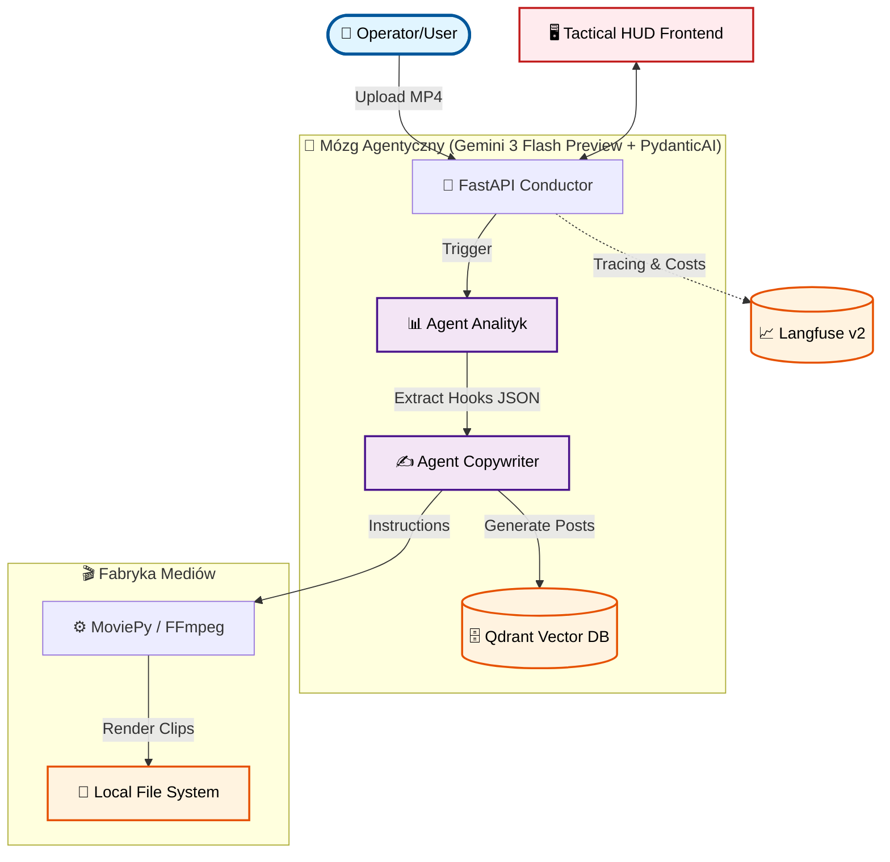

# 🤖 takzenai/omni-operator-v1

**Autonomiczna fabryka dystrybucji treści. Od surowego MP4 do dominacji w social mediach.**


> 🏆 **Zgłoszenie konkursowe**: [Gemini API Developer Competition](https://gemini3.devpost.com/)

---

## 🎯 PROBLEM, KTÓRY ROZWIĄZUJEMY

Content creatorzy tracą **godziny** na żmudną, manualną pracę:

- 🎬 Oglądanie długich nagrań w poszukiwaniu "viralnych momentów" (tzw. hooks).
- ✂️ Cięcie i formatowanie pod wymogi różnych platform.
- ✍️ Pisanie unikalnych opisów, strategii i dobieranie hashtagów.
- 📁 Organizację i fizyczną dystrybucję plików.

**Nasza wizja**: Jeden upload → Pełna automatyzacja agentyczna → Wygenerowane Shortsy i posty gotowe do publikacji w interfejsie klasy premium.

---

## 💡 NASZE ROZWIĄZANIE

**Omni-Operator v1** to suwerenny system AI, który wykorzystuje **Gemini 3 Flash Preview** jako multimodalny procesor decyzyjny do:

- **Multimodalnej analizy (Native Vision)** - Gemini "ogląda" wideo przez nowe SDK `google-genai` i rozumie kontekst wizualny + audio bez żadnych pośrednich narzędzi.
- **Inteligentnego montażu** - Automatyczne wykrywanie najlepszych momentów i generowanie instrukcji dla silnika montażowego.
- **Agentury Copywriterskiej** - Tworzenie unikalnych postów na TikTok, YouTube i LinkedIn zwalidowanych przez PydanticAI.
- **Tactical HUD Interface** - Nowoczesny, agentyczny interfejs użytkownika w stylu "Mission Control" z efektami scanlines, CRT i szklanymi panelami.

---

## 🏗️ ARCHITEKTURA SYSTEMU



## � MISSION VISUALS (TACTICAL HUD)

### FAZA 01: GOTOWOŚĆ_OPERACYJNA (MISSION_READY)
> *Stan gotowości systemu przed przesłaniem materiału źródłowego.*


### FAZA 02: HANGAR_ZASOBÓW (ASSET_HANGAR)
> *Podgląd wygenerowanych treści, strategii social media i zmontowanych klipów.*


---

## 🚀 DLACZEGO GEMINI 3 FLASH PREVIEW?

- ✅ **Szybkość**: Błyskawiczna analiza multimodalna.
- ✅ **Native Video Grounding**: Precyzyjne łączenie treści z czasem (sekundy).
- ✅ **Google Cloud Integration**: Wykorzystanie najnowszego SDK `google-genai` dla bezpiecznego przetwarzania plików.

---

## 🛠️ STOS TECHNOLOGICZNY

| Komponent          | Technologia          | Rola                                        |
20. | ------------------ | -------------------- | ------------------------------------------- |
103. | **Mózg AI**        | Gemini 3 Flash Prev  | Multimodalna analiza i reasoning            |
104. | **Agentura**       | PydanticAI           | Logika agentyczna i typowane wyjścia danych |
105. | **Frontend**       | Next.js 16 + Tailwind 4 | Interfejs Tactical HUD                    |
106. | **Infrastruktura** | Docker & uv          | Zarządzanie kontenerami i pakietami         |
107. | **Monitoring**     | Langfuse v2          | Lokalny tracing i kontrola kosztów          |
108. | **Baza Wektorowa** | Qdrant               | Pamięć doświadczeń                          |
109. | **Serwer API**     | FastAPI              | Dyrygent całego workflowu                   |

---

## 🚀 JAK URUCHOMIĆ

### 1. Przygotowanie Backend (API)
```bash
# Wejdź do folderu głównego
uv sync
docker-compose up -d
# Skonfiguruj .env (GOOGLE_API_KEY, LANGFUSE_*)
uv run src/api/main.py
```

### 2. Przygotowanie Frontend (Web)
```bash
cd web
pnpm install
pnpm dev
# Otwórz http://localhost:4000
```

---

## 🏆 GEMINI API DEVELOPER COMPETITION

Projekt udowadnia, że **Gemini 3 Flash Preview** jest gotowy do roli autonomicznego "Operatora" w najnowocześniejszych systemach Media-Ops.

**Zbudowane z 🔥 przez KUŹNIĘ OPERATORÓW**

