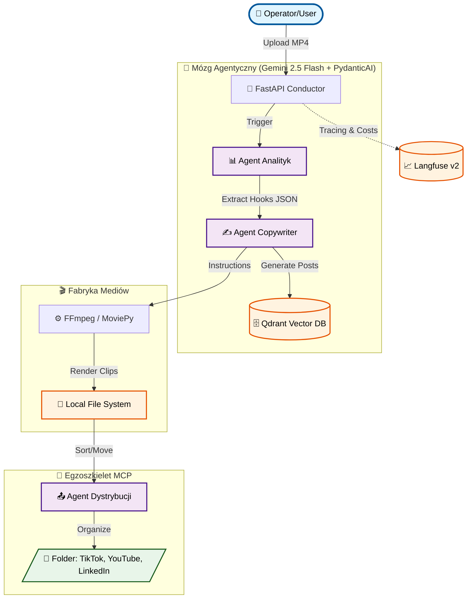

# 🤖 takzenai/omni-operator-v1

**Autonomiczna fabryka dystrybucji treści. Od surowego MP4 do dominacji w social mediach.**


> 🏆 **Zgłoszenie konkursowe**: [Gemini API Developer Competition](https://gemini3.devpost.com/)

---

## 🎯 PROBLEM, KTÓRY ROZWIĄZUJEMY

Content creatorzy tracą **godziny** na żmudną, manualną pracę:

- 🎬 Oglądanie długich nagrań w poszukiwaniu "viralnych momentów" (tzw. hooks).
- ✂️ Cięcie i formatowanie pod wymogi różnych platform (pion 9:16 vs poziom 16:9).
- ✍️ Pisanie unikalnych opisów, strategii i dobieranie hashtagów.
- 📁 Organizację i fizyczną dystrybucję dziesiątek plików.

**Nasza wizja**: Jeden upload → Pełna automatyzacja agentyczna → Gotowe treści w odpowiednich folderach.

---

## 💡 NASZE ROZWIĄZANIE

**Omni-Operator v1** to suwerenny system AI, który wykorzystuje **Gemini 2.5 Flash** jako multimodalny procesor decyzyjny do:

- **Multimodalnej analizy (Native Vision)** - Gemini "ogląda" wideo i rozumie kontekst wizualny + audio bez żadnych pośrednich narzędzi (brak potrzeby Whisper/STT).
- **Inteligentnego montażu** - Automatyczne wykrywanie hooków i generowanie precyzyjnych instrukcji dla silnika FFmpeg.
- **Agentury Copywriterskiej** - Tworzenie unikalnych postów zwalidowanych przez PydanticAI (Structured Outputs).
- **Dystrybucji MCP** - Wykorzystanie protokołu Model Context Protocol do fizycznego zarządzania systemem plików i segregacji gotowych materiałów.

**Sovereign AI Stack** - budujemy na własnej infrastrukturze Dockerowej. Zero uzależnienia od zewnętrznych platform SaaS.

---

## 🏗️ ARCHITEKTURA SYSTEMU



---

## 🚀 DLACZEGO GEMINI 2.5 FLASH?

Wybraliśmy ten model jako fundament fabryki ze względu na unikalne cechy kluczowe w Media-Ops:

### 1. Natywna Multimodalność

- ✅ Analizuje obraz + dźwięk w jednym nurcie.
- ✅ Rozumie dynamikę wizualną (np. "moment rozbłysku", "zmiana mimiki").
- ✅ Video Grounding: Precyzyjne łączenie treści z czasem (timestamp).

### 2. Gigantyczne Okno Kontekstu

- ✅ Możliwość analizy całych podcastów (60 min+) bez dzielenia na fragmenty.
- ✅ Zachowanie spójności narracyjnej między klipem nr 1 a klipem nr 20.

### 3. Efektywność Operacyjna

- ✅ Szybkość: Logiczna analiza 10-minutowego materiału zajmuje średnio 5-10 sekund.
- ✅ Koszt: Dzięki optymalizacji Gemini Flash, koszt produkcji jednej kampanii to często mniej niż $0.10.

---

## 🛠️ STOS TECHNOLOGICZNY (SOVEREIGN STACK)

| Komponent          | Technologia      | Rola                                        |
| ------------------ | ---------------- | ------------------------------------------- |
| **Mózg AI**        | Gemini 2.5 Flash | Multimodalna analiza i reasoning            |
| **Agentura**       | PydanticAI       | Logika agentyczna i typowane wyjścia danych |
| **Infrastruktura** | Docker & uv      | Zarządzanie kontenerami i pakietami         |
| **Monitoring**     | Langfuse v2      | Lokalny tracing i kontrola kosztów          |
| **Pamięć**         | Qdrant           | Wektorowa baza doświadczeń (RAG)            |
| **Media**          | FFmpeg / MoviePy | Programowy montaż wideo                     |
| **Orchestration**  | FastAPI          | Asynchroniczne zarządzanie zadaniami (Jobs) |

---

## 📊 PRZYKŁADOWY WORKFLOW (POC)

```
INPUT:  Nagranie 10-minutowe (prezentacja projektu.mp4)

↓ [Agent Analityk - Gemini 2.5 Flash]
├─ Analizuje klatki i audio (Video-to-JSON)
└─ Output: Plan 3 klipów (np. 00:12-00:45, 03:00-03:20...)

↓ [Agent Copywriter - PydanticAI]
├─ Tworzy posty na LinkedIn (autorytet) i TikTok (hook)
└─ Zapisuje wektory strategii w Qdrant

↓ [Fabryka Mediów - FFmpeg]
├─ Fizycznie wycina klipy z pliku źródłowego
└─ Nadaje format pionowy (Vertical Reframing)

↓ [Agent Dystrybucji - MCP]
└─ Przenosi pliki do folderów: /output/tiktok, /output/linkedin

OUTPUT: 3 gotowe wideo + komplety opisów.
CZAS:   ~90 sekund (łącznie z renderowaniem).
```

---

## 🚀 JAK URUCHOMIĆ

```bash
# 1. Klonowanie i wejście do bazy
git clone https://github.com/takzenai/omni-operator-v1.git
cd omni-operator-v1

# 2. Synchronizacja środowiska (uv)
uv sync

# 3. Start infrastruktury (Qdrant, Langfuse, Postgres)
docker-compose up -d

# 4. Konfiguracja .env
cp .env.example .env
# Uzupełnij GEMINI_API_KEY oraz klucze Langfuse (SALT, NEXTAUTH_SECRET)

# 5. Uruchomienie serwera
uv run python src/api/main.py
```

---

## 💼 POTENCJAŁ BIZNESOWY

**Zalety dla organizacji**:

- ⏰ **95% redukcji czasu**: Z 4 godzin montażu do 2 minut automatyzacji.
- 💰 **Drastyczne oszczędności**: Brak opłat subskrypcyjnych (tylko koszt tokenów Gemini).
- 📈 **Skalowalność**: Możliwość prowadzenia 10 kanałów social media przez jedną osobę (Solo Operator).

---

## 🔮 ROADMAPA ROZWOJU

- [ ] **Agentic Quality Control**: Gemini weryfikuje poprawność wyciętego klipu przed zapisem.
- [ ] **Auto-Thumbnail**: Generowanie miniatur na podstawie najlepszych klatek wideo.
- [ ] **Multi-language**: Automatyczny dubbing i tłumaczenie napisów.

---

## 🏆 GEMINI API DEVELOPER COMPETITION

Projekt udowadnia, że **Gemini 2.5 Flash** jest gotowy do roli autonomicznego "Operatora" w złożonych systemach Media-Ops.

---

**Zbudowane z 🔥 przez KUŹNIĘ OPERATORÓW**
