# 🤖 omni-operator-v1

**Autonomous content distribution factory. From raw MP4 to social media dominance.**


> 🏆 **Competition Entry**: [Gemini API Developer Competition](https://gemini3.devpost.com/)

---

### 📝 SUBMISSION: GEMINI 3 HACKATHON

**Gemini Integration Description (~200 words):**
Omni-Operator V1 is an autonomous media factory powered entirely by **Gemini 3 Flash Preview**. The application leverages Gemini's cutting-edge **native multimodality** for direct video analysis, eliminating the need for traditional transcription or separate vision models. By "watching" raw MP4 files, Gemini 3 Flash identifies moments with high viral potential, utilizing its advanced **Spatial & Temporal Grounding** capabilities.

This integration forms the heart of our "Agentic Brain" architecture. We leverage Gemini 3 Flash's **massive context window** to analyze entire recordings in a single pass, ensuring context preservation and narrative continuity across all generated materials. Furthermore, we use **structured outputs (response_schema)** to translate AI reasoning directly into technical instructions for our FFmpeg-based editing engine. This seamless bridge between substantive multimodal understanding and precise file manipulation allows Omni-Operator to transform raw video into optimized clips for TikTok, YouTube, and LinkedIn in just seconds. In short, Gemini 3 Flash serves as the sovereign cognitive processor, enabling a level of automation and speed that was previously unattainable.

---

## 🛡️ SOVEREIGNTY PROTOCOL (LOCAL-FIRST ARCHITECTURE)

In a world dominated by closed SaaS platforms, **Omni-Operator V1** returns control to the engineer. The system was designed with a **Local-First** architecture, which forms its strategic foundation.

**Key pillars of system sovereignty:**

- **Privacy and Security:** Raw video materials, proprietary marketing strategies, and brand data never leave your controlled environment. We use Gemini 3 Flash Preview as an external cognitive processor via secure encrypted API connection, but all business logic, task states, and knowledge base remain on your disk.
- **SaaS Tax Elimination:** We leverage the power of the Open Source stack. Through containerization (Docker), **Qdrant** databases, **Langfuse** monitoring systems, and **PostgreSQL** database engines run locally. This means zero fixed subscription fees – you only pay for actually consumed Gemini tokens.
- **Operational Independence:** The Operator has full insight into every Agent "trace" and every vector in the system's memory. You're building your own operational intelligence that's resistant to pricing policy changes or terms of service from external editing and distribution tool providers.

> **NOTICE:** The Omni-Operator V1 system doesn't need the cloud to "think" about your data. It only needs your hardware and the Gemini 3 Flash Preview engine.

---

## 🎯 THE PROBLEM WE SOLVE

Content creators waste **hours** on tedious, manual work:

- 🎬 Watching long recordings searching for "viral moments" (hooks).
- ✂️ Cutting and formatting for different platform requirements.
- ✍️ Writing unique descriptions, strategies, and selecting hashtags.
- 📁 Organizing and physically distributing files.

**Our vision**: One upload → Full agentic automation → Generated Shorts and posts ready for publication in a premium-class interface.

---

## 💡 OUR SOLUTION

**Omni-Operator v1** is a sovereign AI system that uses **Gemini 3 Flash Preview** as a multimodal decision processor for:

- **Multimodal Analysis (Native Vision)** - Gemini "watches" video through the new `google-genai` SDK and understands visual + audio context without any intermediate tools.
- **Intelligent Editing** - Automatic detection of best moments and generation of instructions for the editing engine.
- **Copywriting Agency** - Creating unique posts for TikTok, YouTube, and LinkedIn validated by PydanticAI.
- **Tactical HUD Interface** - Modern, agentic user interface in "Mission Control" style with scanlines, CRT effects, and glass panels.
- **Vertical Reframing (9:16)** - Automatic framing of horizontal video to vertical format (Center Crop) optimized for TikTok and Reels.
- **Automatic Branding** - Dynamic overlay of visual layer (Dark Red status bar) branding materials with OPERATORS' FORGE mark.
- **Sovereign RAG Memory** - Every analysis and campaign conducted goes to the Qdrant vector database, creating a unique knowledge and experience base for the system.

---

## 🏗️ SYSTEM ARCHITECTURE

```mermaid
graph TD
    User([👤 Operator/User]) -->|Upload MP4| API[🎯 FastAPI Conductor]
    UI[🖥️ Tactical HUD Frontend] <--> API

    subgraph Brain["🧠 Agentic Brain (Gemini 3 Flash Preview + PydanticAI)"]
        API -->|Trigger| Analyst[📊 Analyst Agent]
        Analyst -->|Extract Hooks JSON| Copywriter[✍️ Copywriter Agent]
        Copywriter -->|Save Experience| Memory[(🗄️ Qdrant Vector DB)]
    end

    subgraph Factory["🎬 Media Factory"]
        Copywriter -->|Instructions| VideoEngine[⚙️ MoviePy / FFmpeg]
        VideoEngine -->|9:16 Crop & Branding| Storage[💾 Local File System]
    end

    API -.->|Tracing & Costs| Langfuse[(📈 Langfuse v2)]

    classDef userNode fill:#e1f5ff,stroke:#01579b,stroke-width:3px,color:#000
    classDef uiNode fill:#ffebee,stroke:#c21d1d,stroke-width:2px,color:#000
    classDef agentNode fill:#f3e5f5,stroke:#4a148c,stroke-width:2px,color:#000
    classDef storageNode fill:#fff3e0,stroke:#e65100,stroke-width:2px,color:#000

    class User userNode
    class UI uiNode
    class Analyst,Copywriter agentNode
    class Memory,Storage,Langfuse storageNode
```



## 📸 MISSION VISUALS (TACTICAL HUD)

### PHASE 01: OPERATIONAL_READINESS (MISSION_READY)

> _System readiness state before uploading source material._ > 

### PHASE 02: ASSET_HANGAR (ASSET_HANGAR)

> _Preview of generated content, social media strategies, and edited clips._ > 

---

## 🚀 WHY GEMINI 3 FLASH PREVIEW?

- ✅ **Speed**: Lightning-fast multimodal analysis.
- ✅ **Native Video Grounding**: Precise linking of content with time (seconds).
- ✅ **Google Cloud Integration**: Utilizing the latest `google-genai` SDK for secure file processing.

---

## 🛠️ TECHNOLOGY STACK

| Component           | Technology              | Role                                 |
| ------------------- | ----------------------- | ------------------------------------ |
| **AI Brain**        | Gemini 3 Flash Prev     | Multimodal analysis and reasoning    |
| **Agency**          | PydanticAI              | Agentic logic and typed data outputs |
| **Frontend**        | Next.js 16 + Tailwind 4 | Tactical HUD Interface               |
| **Infrastructure**  | Docker & uv             | Container and package management     |
| **Monitoring**      | Langfuse v2             | Local tracing and cost control       |
| **Vector Database** | Qdrant                  | Experience memory                    |
| **API Server**      | FastAPI                 | Conductor of the entire workflow     |

---

## 🚀 HOW TO RUN

### 1. Backend Preparation (API)

```bash
# Enter the main folder
uv sync
docker-compose up -d
# Configure .env (GOOGLE_API_KEY, LANGFUSE_*)
uv run src/api/main.py
```

### 2. Frontend Preparation (Web)

```bash
cd web
pnpm install
pnpm dev
# Open http://localhost:4000
```

---

## 🏆 GEMINI API DEVELOPER COMPETITION

The project proves that **Gemini 3 Flash Preview** is ready to serve as an autonomous "Operator" in state-of-the-art Media-Ops systems.

**Built with 🔥 by OPERATORS' FORGE**
