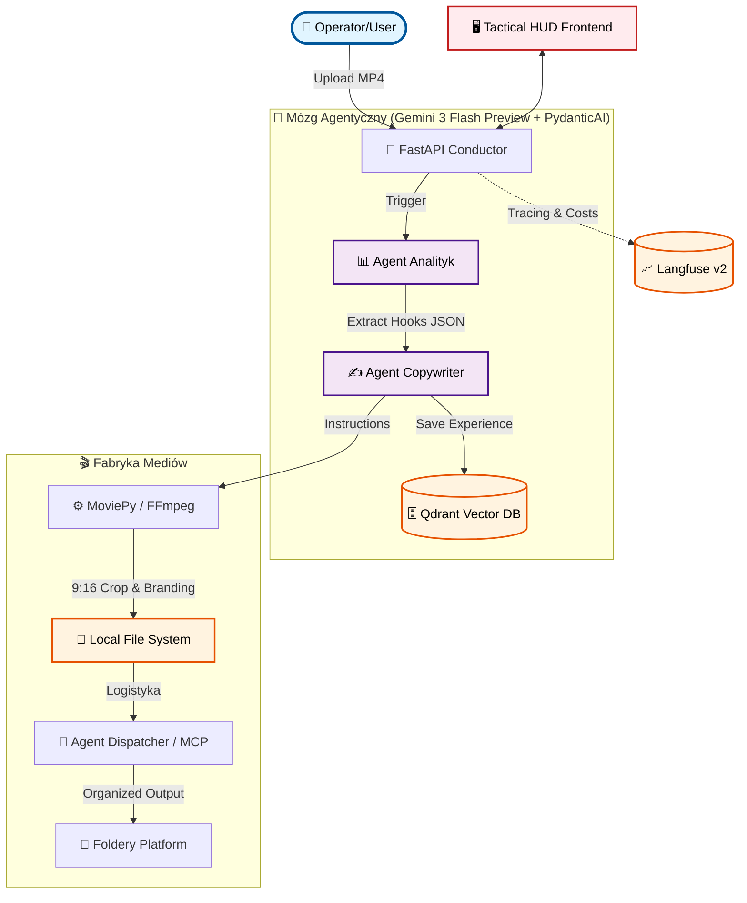
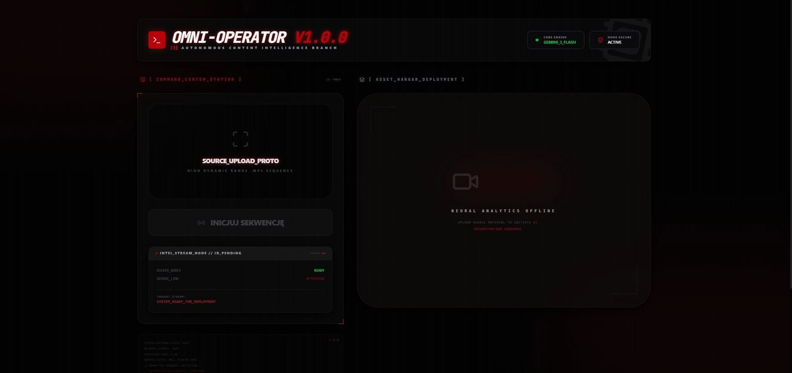
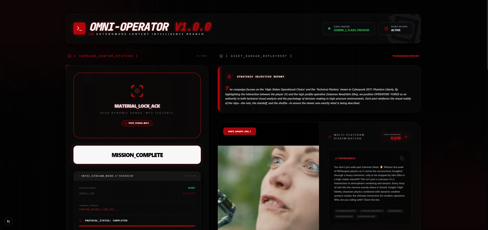

# 🤖 omni-operator-v1

**Autonomiczna fabryka dystrybucji treści. Od surowego MP4 do dominacji w social mediach.**


> 🏆 **Zgłoszenie konkursowe**: [Gemini API Developer Competition](https://gemini3.devpost.com/)

---

### 📝 ZGŁOSZENIE: GEMINI 3 HACKATHON

**Opis Integracji Gemini (~200 słów):**
Omni-Operator V1 to autonomiczna fabryka mediów napędzana w całości przez **Gemini 3 Flash Preview**. Aplikacja wykorzystuje najnowocześniejszą **natywną multimodalność** Gemini do bezpośredniej analizy wideo, eliminując potrzebę stosowania tradycyjnej transkrypcji czy osobnych modeli wizyjnych. Dzięki "oglądaniu" surowych plików MP4, Gemini 3 Flash identyfikuje momenty o wysokim potencjale viralowym, korzystając ze swoich zaawansowanych zdolności **zakotwiczenia przestrzenno-czasowego (Spatial & Temporal Grounding)**.

Integracja ta stanowi serce naszej architektury "Agentycznego Mózgu". Wykorzystujemy **ogromne okno kontekstowe** Gemini 3 Flash do analizy całych nagrań w jednym przebiegu, co gwarantuje zachowanie kontekstu i ciągłości narracyjnej we wszystkich generowanych materiałach. Co więcej, używamy **strukturyzowanych danych wyjściowych (response_schema)**, aby przetłumaczyć rozumowanie AI bezpośrednio na instrukcje techniczne dla naszego silnika edycji opartego na FFmpeg. Ten płynny pomost między merytorycznym zrozumieniem multimodalnym a precyzyjną manipulacją plikami pozwala Omni-Operatorowi przekształcić surowe wideo w zoptymalizowane klipy na TikToka, YouTube'a i LinkedIna w zaledwie kilka sekund. Krótko mówiąc, Gemini 3 Flash pełni rolę suwerennego procesora poznawczego, umożliwiając poziom automatyzacji i szybkości, który wcześniej był nieosiągalny.

---

## 🛡️ PROTOKÓŁ SUWERENNOŚCI (LOCAL-FIRST ARCHITECTURE)

W świecie zdominowanym przez zamknięte platformy SaaS, **Omni-Operator V1** przywraca kontrolę w ręce inżyniera. System został zaprojektowany w architekturze **Local-First**, co stanowi jego fundament strategiczny.

**Kluczowe filary suwerenności systemu:**

- **Prywatność i Bezpieczeństwo:** Surowe materiały wideo, autorskie strategie marketingowe oraz dane o marce nigdy nie opuszczają Twojego kontrolowanego środowiska. Wykorzystujemy Gemini 3 Flash Preview jako zewnętrzny procesor poznawczy poprzez bezpieczne szyfrowane połączenie API, ale cała logika biznesowa, stany zadań i baza wiedzy pozostają na Twoim dysku.
- **Eliminacja Podatku SaaS:** Wykorzystujemy potęgę stosu Open Source. Dzięki konteneryzacji (Docker), bazy danych **Qdrant**, systemy monitoringu **Langfuse** oraz silniki bazodanowe **PostgreSQL** działają lokalnie. Oznacza to zero stałych opłat subskrypcyjnych – płacisz wyłącznie za realnie zużyte tokeny Gemini.
- **Niezależność Operacyjna:** Operator posiada pełny wgląd w każdy "ślad" (trace) Agenta i każdy wektor w pamięci systemu. Budujesz własną inteligencję operacyjną, która jest odporna na zmiany polityk cenowych czy regulaminów zewnętrznych dostawców narzędzi do edycji i dystrybucji.

> **KOMUNIKAT:** System Omni-Operator V1 nie potrzebuje chmury, aby "myśleć" o Twoich danych. On potrzebuje tylko Twojego sprzętu i silnika Gemini 3 Flash Preview.

---

## 🎯 PROBLEM, KTÓRY ROZWIĄZUJEMY

Content creatorzy tracą **godziny** na żmudną, manualną pracę:

- 🎬 Oglądanie długich nagrań w poszukiwaniu "viralnych momentów" (tzw. hooks).
- ✂️ Cięcie i formatowanie pod wymogi różnych platform.
- ✍️ Pisanie unikalnych opisów, strategii i dobieranie hashtagów.
- 📁 Organizację i fizyczną dystrybucję plików.

**Nasza wizja**: Jeden upload → Pełna automatyzacja agentyczna → Wygenerowane Shortsy i posty gotowe do publikacji w interfejsie klasy premium.

---

## 💡 NASZE ROZWIĄZANIE

**Omni-Operator v1** to suwerenny system AI, który wykorzystuje **Gemini 3 Flash Preview** jako multimodalny procesor decyzyjny do:

- **Multimodalnej analizy (Native Vision)** - Gemini "ogląda" wideo przez nowe SDK `google-genai` i rozumie kontekst wizualny + audio bez żadnych pośrednich narzędzi.
- **Inteligentnego montażu** - Automatyczne wykrywanie najlepszych momentów i generowanie instrukcji dla silnika montażowego.
- **Agentury Copywriterskiej** - Tworzenie unikalnych postów na TikTok, YouTube i LinkedIn zwalidowanych przez PydanticAI.
- **Dyrektywy Operatora (Human-in-the-loop)** - Wstrzykiwanie instrukcji w czasie rzeczywistym, pozwalające Operatorowi sterować analizą AI i copywritingiem (np. "Pisz po polsku", "Skup się na technicznych detalach").
- **Agent Dispatcher (MCP)** - Autonomiczna dystrybucja zasobów pod konkretne platformy z wykorzystaniem Model Context Protocol. Inteligentna logistyka plików do dedykowanych folderów.
- **Vertical Reframing (9:16)** - Automatyczne kadrowanie poziomego wideo do formatu pionowego (Center Crop) zoptymalizowanego pod TikTok i Reels.
- **Profesjonalny Branding** - Automatyczne nakładanie znaku wodnego z logo (`logo.png`) oraz dynamiczne paski stanu dla materiałów klasy premium.
- **Sovereign RAG Memory** - Każda przeprowadzona analiza i kampania trafia do wektorowej bazy Qdrant, tworząc unikalną bazę wiedzy i doświadczeń systemu.

---

## 🏗️ ARCHITEKTURA SYSTEMU



## � MISSION VISUALS (TACTICAL HUD)

### FAZA 01: GOTOWOŚĆ_OPERACYJNA (MISSION_READY)

> _Stan gotowości systemu przed przesłaniem materiału źródłowego._ > 

### FAZA 02: HANGAR_ZASOBÓW (ASSET_HANGAR)

> _Podgląd wygenerowanych treści, strategii social media i zmontowanych klipów._ > 

---

## 🚀 DLACZEGO GEMINI 3 FLASH PREVIEW?

- ✅ **Szybkość**: Błyskawiczna analiza multimodalna.
- ✅ **Native Video Grounding**: Precyzyjne łączenie treści z czasem (sekundy).
- ✅ **Google Cloud Integration**: Wykorzystanie najnowszego SDK `google-genai` dla bezpiecznego przetwarzania plików.

---

## 🛠️ STOS TECHNOLOGICZNY

| Komponent          | Technologia             | Rola                                        |
| ------------------ | ----------------------- | ------------------------------------------- |
| **Mózg AI**        | Gemini 3 Flash Prev     | Multimodalna analiza i reasoning            |
| **Agentura**       | PydanticAI              | Logika agentyczna i typowane wyjścia danych |
| **Frontend**       | Next.js 16 + Tailwind 4 | Interfejs Tactical HUD                      |
| **Infrastruktura** | Docker & uv             | Zarządzanie kontenerami i pakietami         |
| **Monitoring**     | Langfuse v2             | Lokalny tracing i kontrola kosztów          |
| **Baza Wektorowa** | Qdrant                  | Pamięć doświadczeń                          |
| **Serwer API**     | FastAPI                 | Dyrygent całego workflowu                   |

---

## 🚀 JAK URUCHOMIĆ

### 1. Przygotowanie Backend (API)

```bash
# Wejdź do folderu głównego
uv sync
docker-compose up -d
# Skonfiguruj .env (GOOGLE_API_KEY, LANGFUSE_*)
uv run src/api/main.py
```

### 2. Przygotowanie Frontend (Web)

```bash
cd web
pnpm install
pnpm dev
# Otwórz http://localhost:4000
```

---

## 🏆 GEMINI API DEVELOPER COMPETITION

Projekt udowadnia, że **Gemini 3 Flash Preview** jest gotowy do roli autonomicznego "Operatora" w najnowocześniejszych systemach Media-Ops.

**Zbudowane z 🔥 przez KUŹNIĘ OPERATORÓW**
